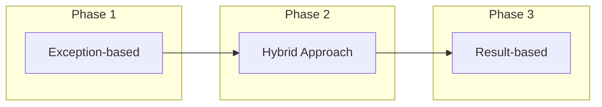

# Migrating from Exceptions to Result Pattern

This guide helps you migrate from traditional exception-based error handling to the Result pattern using FluentUnions.

## Table of Contents
1. [Why Migrate?](#why-migrate)
2. [Migration Strategy](#migration-strategy)
3. [Common Patterns](#common-patterns)
4. [Step-by-Step Examples](#step-by-step-examples)
5. [Gradual Migration](#gradual-migration)
6. [Testing Migration](#testing-migration)
7. [Common Pitfalls](#common-pitfalls)
8. [Best Practices](#best-practices)

## Why Migrate?

### Problems with Exceptions

```csharp
// Traditional exception-based code
public User GetUser(int id)
{
    if (id <= 0)
        throw new ArgumentException("Invalid user ID");
    
    var user = _database.FindUser(id);
    if (user == null)
        throw new UserNotFoundException($"User {id} not found");
    
    if (!user.IsActive)
        throw new InvalidOperationException("User is not active");
    
    return user;
}

// Problems:
// 1. Exceptions are invisible in method signature
// 2. Easy to forget to catch exceptions
// 3. Performance overhead for expected failures
// 4. Stack unwinding makes debugging harder
// 5. Difficult to compose operations
```

### Benefits of Result Pattern

```csharp
// Result-based code
public Result<User> GetUser(int id)
{
    if (id <= 0)
        return new ValidationError("Invalid user ID");
    
    var user = _database.FindUser(id);
    if (user == null)
        return new NotFoundError("User", id);
    
    if (!user.IsActive)
        return new ValidationError("User is not active");
    
    return Result.Success(user);
}

// Benefits:
// 1. Errors are explicit in return type
// 2. Compiler enforces error handling
// 3. No performance overhead for expected failures
// 4. Easy to compose and chain operations
// 5. Better debugging experience
```

## Migration Strategy

### 1. Identify Exception Types

First, catalog the exceptions in your codebase:

```csharp
// Domain exceptions (expected failures)
- ValidationException     → ValidationError
- NotFoundException       → NotFoundError
- ConflictException      → ConflictError
- UnauthorizedException  → AuthorizationError
- BusinessRuleException  → Custom Error

// System exceptions (unexpected failures)
- NullReferenceException → Keep as exception
- OutOfMemoryException   → Keep as exception
- StackOverflowException → Keep as exception
```

### 2. Create Error Type Mappings

```csharp
public static class ExceptionToErrorMapper
{
    public static Error ToError(this Exception exception)
    {
        return exception switch
        {
            ValidationException ve => new ValidationError(ve.Message)
                .WithMetadata("field", ve.Field),
            
            NotFoundException nfe => new NotFoundError(nfe.ResourceType, nfe.ResourceId),
            
            ConflictException ce => new ConflictError(ce.Message),
            
            UnauthorizedException ue => new AuthorizationError(ue.Message),
            
            BusinessRuleException bre => new Error(bre.ErrorCode, bre.Message),
            
            // For unexpected exceptions during migration
            _ => new Error("SYSTEM_ERROR", "An unexpected error occurred")
                .WithMetadata("exceptionType", exception.GetType().Name)
        };
    }
}
```

### 3. Migration Phases



## Common Patterns

### Repository Pattern Migration

**Before:**
```csharp
public interface IUserRepository
{
    User GetById(int id); // Throws NotFoundException
    User Create(User user); // Throws ValidationException, ConflictException
    void Update(User user); // Throws NotFoundException, ConcurrencyException
    void Delete(int id); // Throws NotFoundException
}

public class UserRepository : IUserRepository
{
    public User GetById(int id)
    {
        var user = _context.Users.Find(id);
        if (user == null)
            throw new NotFoundException($"User {id} not found");
        return user;
    }
    
    public User Create(User user)
    {
        if (_context.Users.Any(u => u.Email == user.Email))
            throw new ConflictException("Email already exists");
            
        _context.Users.Add(user);
        _context.SaveChanges();
        return user;
    }
}
```

**After:**
```csharp
public interface IUserRepository
{
    Result<User> GetById(int id);
    Result<User> Create(User user);
    Result Update(User user);
    Result Delete(int id);
}

public class UserRepository : IUserRepository
{
    public Result<User> GetById(int id)
    {
        var user = _context.Users.Find(id);
        return user != null 
            ? Result.Success(user)
            : new NotFoundError("User", id);
    }
    
    public Result<User> Create(User user)
    {
        if (_context.Users.Any(u => u.Email == user.Email))
            return new ConflictError("Email already exists");
            
        _context.Users.Add(user);
        _context.SaveChanges();
        return Result.Success(user);
    }
}
```

### Service Layer Migration

**Before:**
```csharp
public class UserService
{
    public UserDto RegisterUser(RegisterRequest request)
    {
        // Validate
        if (string.IsNullOrEmpty(request.Email))
            throw new ValidationException("Email is required");
            
        if (request.Password.Length < 8)
            throw new ValidationException("Password must be at least 8 characters");
        
        try
        {
            // Check if exists
            var existing = _repository.GetByEmail(request.Email);
            throw new ConflictException("Email already registered");
        }
        catch (NotFoundException)
        {
            // Expected - user doesn't exist
        }
        
        // Create user
        var user = new User
        {
            Email = request.Email,
            Password = HashPassword(request.Password)
        };
        
        var created = _repository.Create(user);
        
        // Send email
        try
        {
            _emailService.SendWelcomeEmail(created.Email);
        }
        catch (EmailException ex)
        {
            _logger.LogError(ex, "Failed to send welcome email");
            // Continue anyway
        }
        
        return new UserDto(created);
    }
}
```

**After:**
```csharp
public class UserService
{
    public Result<UserDto> RegisterUser(RegisterRequest request)
    {
        // Validate
        var validationResult = ValidateRegistration(request);
        if (validationResult.IsFailure)
            return Result.Failure<UserDto>(validationResult.Error);
        
        // Check if exists
        return _repository.GetByEmail(request.Email)
            .Match(
                onSuccess: _ => Result.Failure<UserDto>(
                    new ConflictError("Email already registered")),
                onFailure: error => error is NotFoundError 
                    ? CreateUser(request)
                    : Result.Failure<UserDto>(error)
            );
    }
    
    private Result<UserDto> CreateUser(RegisterRequest request)
    {
        var user = new User
        {
            Email = request.Email,
            Password = HashPassword(request.Password)
        };
        
        return _repository.Create(user)
            .Tap(u => SendWelcomeEmailSafe(u.Email))
            .Map(u => new UserDto(u));
    }
    
    private Result ValidateRegistration(RegisterRequest request)
    {
        var errors = new List<Error>();
        
        if (string.IsNullOrEmpty(request.Email))
            errors.Add(new ValidationError("email", "Email is required"));
            
        if (request.Password.Length < 8)
            errors.Add(new ValidationError("password", 
                "Password must be at least 8 characters"));
        
        return errors.Any() 
            ? Result.Failure(new AggregateError("Validation failed", errors))
            : Result.Success();
    }
    
    private void SendWelcomeEmailSafe(string email)
    {
        try
        {
            _emailService.SendWelcomeEmail(email);
        }
        catch (EmailException ex)
        {
            _logger.LogError(ex, "Failed to send welcome email to {Email}", email);
        }
    }
}
```

### Controller Migration

**Before:**
```csharp
[ApiController]
public class UserController : ControllerBase
{
    [HttpGet("{id}")]
    public ActionResult<UserDto> GetUser(int id)
    {
        try
        {
            var user = _userService.GetUser(id);
            return Ok(user);
        }
        catch (NotFoundException ex)
        {
            return NotFound(new { error = ex.Message });
        }
        catch (UnauthorizedException ex)
        {
            return Unauthorized(new { error = ex.Message });
        }
        catch (Exception ex)
        {
            _logger.LogError(ex, "Error getting user {Id}", id);
            return StatusCode(500, new { error = "Internal server error" });
        }
    }
}
```

**After:**
```csharp
[ApiController]
public class UserController : ControllerBase
{
    [HttpGet("{id}")]
    public ActionResult<UserDto> GetUser(int id)
    {
        return _userService.GetUser(id)
            .Match<ActionResult<UserDto>>(
                onSuccess: user => Ok(user),
                onFailure: error => error switch
                {
                    NotFoundError => NotFound(new { error = error.Message }),
                    AuthorizationError => Unauthorized(new { error = error.Message }),
                    _ => StatusCode(500, new { error = "Internal server error" })
                });
    }
    
    // Or with extension method
    [HttpGet("{id}")]
    public ActionResult<UserDto> GetUserV2(int id)
    {
        return _userService.GetUser(id).ToActionResult();
    }
}
```

## Step-by-Step Examples

### Example 1: Simple Method

**Step 1: Original Exception-based Code**
```csharp
public decimal CalculateDiscount(Order order, string promoCode)
{
    if (order == null)
        throw new ArgumentNullException(nameof(order));
        
    if (order.Total <= 0)
        throw new ArgumentException("Order total must be positive");
        
    var promo = _promoRepository.GetByCode(promoCode);
    if (promo == null)
        throw new NotFoundException($"Promo code '{promoCode}' not found");
        
    if (promo.ExpiryDate < DateTime.UtcNow)
        throw new InvalidOperationException("Promo code has expired");
        
    return order.Total * promo.DiscountPercentage;
}
```

**Step 2: Create Result-based Version**
```csharp
public Result<decimal> CalculateDiscountSafe(Order order, string promoCode)
{
    if (order == null)
        return new ValidationError("Order is required");
        
    if (order.Total <= 0)
        return new ValidationError("Order total must be positive");
        
    return _promoRepository.GetByCode(promoCode)
        .Bind(promo => promo.ExpiryDate < DateTime.UtcNow
            ? Result.Failure<PromoCode>(new ValidationError("Promo code has expired"))
            : Result.Success(promo))
        .Map(promo => order.Total * promo.DiscountPercentage);
}
```

**Step 3: Create Adapter During Migration**
```csharp
// Temporary adapter for backward compatibility
public decimal CalculateDiscount(Order order, string promoCode)
{
    var result = CalculateDiscountSafe(order, promoCode);
    if (result.IsSuccess)
        return result.Value;
        
    // Convert back to exception for compatibility
    throw result.Error switch
    {
        ValidationError ve => new ArgumentException(ve.Message),
        NotFoundError nfe => new NotFoundException(nfe.Message),
        _ => new InvalidOperationException(result.Error.Message)
    };
}
```

### Example 2: Complex Business Logic

**Before:**
```csharp
public class OrderService
{
    public Order ProcessOrder(ProcessOrderRequest request)
    {
        // Validate request
        ValidateRequest(request); // Throws ValidationException
        
        // Get customer
        Customer customer;
        try
        {
            customer = _customerRepository.GetById(request.CustomerId);
        }
        catch (NotFoundException)
        {
            throw new BusinessException("Customer not found");
        }
        
        // Check credit
        if (!_creditService.HasSufficientCredit(customer, request.Total))
            throw new InsufficientCreditException("Insufficient credit");
        
        // Check inventory
        foreach (var item in request.Items)
        {
            var product = _productRepository.GetById(item.ProductId);
            if (product.Stock < item.Quantity)
                throw new OutOfStockException($"Product {product.Name} is out of stock");
        }
        
        // Create order
        var order = new Order
        {
            CustomerId = customer.Id,
            Items = request.Items,
            Total = request.Total
        };
        
        // Process payment
        try
        {
            var payment = _paymentService.ProcessPayment(customer, request.Total);
            order.PaymentId = payment.Id;
        }
        catch (PaymentException ex)
        {
            throw new OrderProcessingException("Payment failed", ex);
        }
        
        // Save order
        return _orderRepository.Save(order);
    }
}
```

**After:**
```csharp
public class OrderService
{
    public Result<Order> ProcessOrder(ProcessOrderRequest request)
    {
        return ValidateRequest(request)
            .Bind(_ => GetCustomer(request.CustomerId))
            .Bind(customer => CheckCredit(customer, request.Total))
            .Bind(customer => CheckInventory(request.Items)
                .Map(_ => customer))
            .Bind(customer => CreateAndProcessOrder(customer, request));
    }
    
    private Result ValidateRequest(ProcessOrderRequest request)
    {
        var errors = new List<Error>();
        
        if (request == null)
            errors.Add(new ValidationError("Request is required"));
        else
        {
            if (request.CustomerId <= 0)
                errors.Add(new ValidationError("customerId", "Invalid customer ID"));
            if (!request.Items?.Any() ?? true)
                errors.Add(new ValidationError("items", "Order must have items"));
            if (request.Total <= 0)
                errors.Add(new ValidationError("total", "Total must be positive"));
        }
        
        return errors.Any()
            ? Result.Failure(new AggregateError("Validation failed", errors))
            : Result.Success();
    }
    
    private Result<Customer> GetCustomer(int customerId)
    {
        return _customerRepository.GetById(customerId);
    }
    
    private Result<Customer> CheckCredit(Customer customer, decimal amount)
    {
        return _creditService.GetAvailableCredit(customer)
            .Bind(credit => credit >= amount
                ? Result.Success(customer)
                : Result.Failure<Customer>(
                    new InsufficientCreditError(amount, credit)));
    }
    
    private Result CheckInventory(List<OrderItem> items)
    {
        var errors = new List<Error>();
        
        foreach (var item in items)
        {
            var productResult = _productRepository.GetById(item.ProductId);
            if (productResult.IsFailure)
            {
                errors.Add(productResult.Error);
                continue;
            }
            
            var product = productResult.Value;
            if (product.Stock < item.Quantity)
            {
                errors.Add(new OutOfStockError(
                    product.Id, 
                    item.Quantity, 
                    product.Stock));
            }
        }
        
        return errors.Any()
            ? Result.Failure(new AggregateError("Inventory check failed", errors))
            : Result.Success();
    }
    
    private Result<Order> CreateAndProcessOrder(
        Customer customer, 
        ProcessOrderRequest request)
    {
        var order = new Order
        {
            CustomerId = customer.Id,
            Items = request.Items,
            Total = request.Total
        };
        
        return _paymentService.ProcessPayment(customer, request.Total)
            .Map(payment =>
            {
                order.PaymentId = payment.Id;
                return order;
            })
            .Bind(o => _orderRepository.Save(o));
    }
}
```

## Gradual Migration

### Parallel Implementation Strategy

```csharp
public interface IUserService
{
    // Keep old interface during migration
    User GetUser(int id); // Throws exceptions
    
    // Add new Result-based methods
    Result<User> GetUserSafe(int id);
}

public class UserService : IUserService
{
    // New implementation
    public Result<User> GetUserSafe(int id)
    {
        if (id <= 0)
            return new ValidationError("Invalid user ID");
            
        return _repository.GetById(id);
    }
    
    // Adapter for old interface
    public User GetUser(int id)
    {
        var result = GetUserSafe(id);
        if (result.IsSuccess)
            return result.Value;
            
        throw new UserNotFoundException(result.Error.Message);
    }
}
```

### Feature Flag Migration

```csharp
public class FeatureFlaggedService
{
    private readonly IFeatureFlags _features;
    
    public async Task<object> ProcessRequest(Request request)
    {
        if (_features.IsEnabled("UseResultPattern"))
        {
            // New Result-based implementation
            var result = await ProcessRequestWithResult(request);
            return result.Match(
                onSuccess: data => data,
                onFailure: error => throw ConvertToException(error)
            );
        }
        else
        {
            // Original exception-based implementation
            return await ProcessRequestWithExceptions(request);
        }
    }
}
```

### Logging During Migration

```csharp
public class MigrationLogger
{
    private readonly ILogger _logger;
    
    public Result<T> LogAndConvert<T>(Func<T> exceptionFunc, string operation)
    {
        try
        {
            var result = exceptionFunc();
            _logger.LogDebug("Operation {Operation} succeeded", operation);
            return Result.Success(result);
        }
        catch (Exception ex)
        {
            _logger.LogWarning(ex, 
                "Exception caught during migration in {Operation}", operation);
            return Result.Failure<T>(ex.ToError());
        }
    }
}
```

## Testing Migration

### Test Both Implementations

```csharp
[TestFixture]
public class UserServiceMigrationTests
{
    private UserService _service;
    
    [Test]
    public void GetUser_WhenNotFound_ThrowsException()
    {
        // Test exception-based method
        Assert.Throws<NotFoundException>(() => _service.GetUser(999));
    }
    
    [Test]
    public void GetUserSafe_WhenNotFound_ReturnsFailure()
    {
        // Test Result-based method
        var result = _service.GetUserSafe(999);
        
        Assert.That(result.IsFailure, Is.True);
        Assert.That(result.Error, Is.TypeOf<NotFoundError>());
    }
    
    [Test]
    public void BothMethods_ReturnSameData_WhenSuccessful()
    {
        // Ensure compatibility
        var id = 123;
        
        var exceptionResult = _service.GetUser(id);
        var resultResult = _service.GetUserSafe(id);
        
        Assert.That(resultResult.IsSuccess, Is.True);
        Assert.That(resultResult.Value, Is.EqualTo(exceptionResult));
    }
}
```

### Migration Test Helpers

```csharp
public static class MigrationTestHelpers
{
    public static void AssertEquivalent<T>(
        Func<T> exceptionFunc,
        Func<Result<T>> resultFunc)
    {
        // Test success case
        try
        {
            var exceptionResult = exceptionFunc();
            var resultResult = resultFunc();
            
            Assert.That(resultResult.IsSuccess, Is.True);
            Assert.That(resultResult.Value, Is.EqualTo(exceptionResult));
        }
        catch (Exception ex)
        {
            var resultResult = resultFunc();
            Assert.That(resultResult.IsFailure, Is.True);
            AssertErrorMatchesException(resultResult.Error, ex);
        }
    }
    
    private static void AssertErrorMatchesException(Error error, Exception ex)
    {
        var expectedError = ex.ToError();
        Assert.That(error.Code, Is.EqualTo(expectedError.Code));
        Assert.That(error.Message, Is.EqualTo(expectedError.Message));
    }
}
```

## Common Pitfalls

### 1. Forgetting to Handle All Error Cases

```csharp
// Bad - missing error handling
public void ProcessUser(int id)
{
    var user = GetUserSafe(id).Value; // Can throw!
}

// Good - handle all cases
public void ProcessUser(int id)
{
    GetUserSafe(id).Match(
        onSuccess: user => Process(user),
        onFailure: error => LogError(error)
    );
}
```

### 2. Nested Result Types

```csharp
// Bad - creates Result<Result<T>>
public Result<Result<User>> GetUserWrapped(int id)
{
    return Result.Success(GetUserSafe(id));
}

// Good - use Bind to flatten
public Result<User> GetUserFlattened(int id)
{
    return ValidateId(id)
        .Bind(_ => GetUserSafe(id));
}
```

### 3. Mixing Patterns Incorrectly

```csharp
// Bad - catching exceptions from Result operations
public Result<User> GetUser(int id)
{
    try
    {
        return _repository.GetById(id); // Returns Result<User>
    }
    catch (Exception ex)
    {
        // Result methods shouldn't throw!
        return Result.Failure<User>(new Error("ERROR", ex.Message));
    }
}

// Good - Result methods don't throw
public Result<User> GetUser(int id)
{
    return _repository.GetById(id);
}
```

### 4. Converting System Exceptions

```csharp
// Bad - converting all exceptions to Results
public Result<string> ReadFile(string path)
{
    try
    {
        return Result.Success(File.ReadAllText(path));
    }
    catch (Exception ex)
    {
        // Don't convert system exceptions like OutOfMemoryException
        return Result.Failure<string>(ex.ToError());
    }
}

// Good - only convert expected exceptions
public Result<string> ReadFile(string path)
{
    try
    {
        if (!File.Exists(path))
            return new NotFoundError("File", path);
            
        return Result.Success(File.ReadAllText(path));
    }
    catch (UnauthorizedAccessException)
    {
        return new AuthorizationError($"Cannot access file: {path}");
    }
    // Let system exceptions propagate
}
```

## Best Practices

### 1. Start with New Code

Begin using Result pattern in new features before migrating existing code:

```csharp
// New feature uses Result from the start
public class NewFeatureService
{
    public Result<FeatureData> ProcessNewFeature(FeatureRequest request)
    {
        return ValidateRequest(request)
            .Bind(req => LoadRequiredData(req))
            .Bind(data => ProcessData(data))
            .Map(result => new FeatureData(result));
    }
}
```

### 2. Create Semantic Error Types

```csharp
// Instead of generic errors
return new Error("INVALID_AGE", "Age must be positive");

// Create domain-specific errors
public class InvalidAgeError : ValidationError
{
    public InvalidAgeError(int age) 
        : base($"Age must be positive, but was {age}")
    {
        WithMetadata("providedAge", age);
        WithMetadata("minimumAge", 0);
    }
}
```

### 3. Maintain API Compatibility

```csharp
public class BackwardCompatibleService
{
    // Mark old methods as obsolete
    [Obsolete("Use ProcessRequestSafe instead")]
    public Response ProcessRequest(Request request)
    {
        var result = ProcessRequestSafe(request);
        return result.GetValueOrThrow();
    }
    
    // New Result-based method
    public Result<Response> ProcessRequestSafe(Request request)
    {
        // Implementation
    }
}
```

### 4. Document Migration Status

```csharp
/// <summary>
/// User service for managing user operations
/// </summary>
/// <remarks>
/// Migration Status: In Progress
/// - GetUser: ✓ Migrated
/// - CreateUser: ✓ Migrated  
/// - UpdateUser: ⚠️ In Progress
/// - DeleteUser: ❌ Not Started
/// </remarks>
public class UserService
{
    // Implementation
}
```

## Summary

Migrating from exceptions to Result pattern:

1. **Improves code clarity** - Errors are explicit in signatures
2. **Enhances composability** - Operations chain naturally
3. **Reduces surprises** - No hidden exception paths
4. **Better performance** - No stack unwinding for expected failures
5. **Easier testing** - All paths are explicit

Key strategies:
- Start with new code
- Migrate gradually with adapters
- Keep both interfaces during transition
- Test thoroughly
- Document migration progress

Next steps:
- [Migrating from Nullable Types](from-nullable.md)
- [Testing Guide](../guides/testing-guide.md)
- [Result Pattern Basics](../tutorials/result-pattern-basics.md)